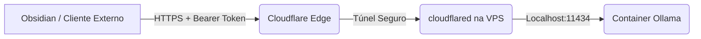

# Cloudflare Tunnel Configuration (AIOX VPS Bridge)

## 1. Arquitetura
O Cloudflare Tunnel (`cloudflared`) é utilizado para expor o endpoint da API do Ollama (`11434`) de forma segura, sem abrir portas no firewall da VPS.

## 2. Status do Provisionamento
- [x] Binário `cloudflared` instalado em `/usr/local/bin/cloudflared`.
- [x] Autenticação (`cloudflared tunnel login`) ✅.
- [x] Criação do túnel `aiox-ollama` (`5b14dfce-5644-4e0f-a9e9-b2af36a38f04`) ✅.
- [x] Configuração de DNS (`ollama-aiox.jhonnyxprite.com`) ✅.
- [x] Proxy de Autenticação Bearer (porta 11435) ✅.

## 3. Segurança & Autenticação
O acesso ao túnel é protegido por:
1. **Cloudflare Zero Trust:** Camada de autenticação obrigatória via Cloudflare Dash.
2. **Bearer Token:** O plugin de Obsidian deve enviar o header `Authorization: Bearer <token>`.

## 4. Guia de Configuração (Local)
Para conectar ferramentas locais (como o Obsidian) ao Ollama da VPS:
1. URL: `https://ollama-aiox.jhonnyxprite.com`
2. Auth: Bearer Token configurado no AIOX.
3. Token: `cb0f400d-a6d8-4ec8-a350-097fe0a20b3c` (Salvo em seu `.env` local).

## 5. Troubleshooting
- Verificar logs do túnel: `journalctl -u cloudflared -f`
- Testar conectividade local: `curl http://localhost:11434/api/tags`
