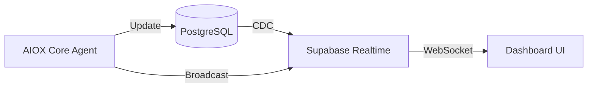

# Spec: Integração de Dados em Tempo Real

> **Story ID:** 3.2
> **Complexity:** STANDARD
> **Generated:** 2026-03-13T18:35:00Z
> **Status:** Draft

---

## 1. Overview

Esta especificação define a implementação do pipeline de dados em tempo real para o AIOX Dashboard. O objetivo é permitir que métricas de agentes e status do sistema sejam visualizados instantaneamente sem necessidade de refresh manual, utilizando o protocolo Supabase Realtime.

### 1.1 Goals

- Estabelecer conexão WebSocket/Realtime estável. (FR-1)
- Garantir latência < 100ms para atualizações críticas. (FR-2)
- Implementar resiliência com reconexão automática. (FR-3)
- Garantir limpeza de recursos (subscrições) para evitar memory leaks. (FR-4)
- Padronizar o formato das mensagens enviadas. (FR-5)
- Prover feedback visual de estado da conexão no dashboard. (FR-7)

### 1.2 Non-Goals

- Implementar lógica complexa de processamento de métricas (apenas o transporte).
- Escalar para milhões de conexões simultâneas nesta fase (foco em uso interno/dev).

---

## 2. Requirements Summary

### 2.1 Functional Requirements

| ID   | Description                                                                 | Priority | Source            |
| ---- | --------------------------------------------------------------------------- | -------- | ----------------- |
| FR-1 | Estabelecer conexão estável via Supabase Realtime/WebSocket.                | P0       | requirements.json |
| FR-2 | Latência de atualização < 100ms (p95).                                      | P0       | requirements.json |
| FR-3 | Reconexão automática com exponential backoff.                               | P1       | requirements.json |
| FR-4 | Prevenção de memory leaks em subscrições e limpezas.                        | P0       | requirements.json |
| FR-5 | Formato de mensagem versionado e documentado.                               | P1       | requirements.json |
| FR-6 | Tratamento de erros de rede e timeouts.                                     | P1       | requirements.json |
| FR-7 | Atualizações reativas na UI do dashboard.                                   | P1       | requirements.json |
| FR-8 | Integridade de dados: real-time deve refletir o banco de dados.             | P1       | requirements.json |

### 2.2 Non-Functional Requirements

| ID    | Category    | Requirement                                  | Metric               |
| ----- | ----------- | -------------------------------------------- | -------------------- |
| NFR-1 | Performance | Suportar > 1000 métricas/seg.                | Throughput > 1000/s  |
| NFR-2 | Security    | Autenticação via JWT e RLS mandatório.       | 100% Auth            |

### 2.3 Constraints

| ID    | Type      | Constraint                                                    | Impact                                 |
| ----- | --------- | ------------------------------------------------------------- | -------------------------------------- |
| CON-1 | Technical | Uso preferencial do Supabase Realtime.                        | Unifica stack de dados e eventos       |

---

## 3. Technical Approach

### 3.1 Architecture Overview

Utilizaremos o **Supabase Realtime** como middleware de mensagens. 
1. **Postgres Changes**: Para dados que precisam persistir (ex: métricas históricas).
2. **Broadcast**: Para dados efêmeros ou de altíssima frequência (ex: status de batimento cardíaco do agente).

### 3.2 Component Design

- **Backend (Node.js)**: 
  - `RealtimeService`: Centraliza emissão de eventos.
  - `AgentEventEmitter`: Intercepta mudanças no estado dos agentes e dispara updates.
- **Frontend (React)**:
  - `useRealtimeSubscription`: Hook customizado para gerenciar lifecycle da subscrição.
  - `ConnectionIndicator`: Componente visual para status da conexão.

### 3.3 Data Flow



---

## 4. Dependencies

### 4.1 External Dependencies

| Dependency | Version | Purpose | Verified |
| ---------- | ------- | ------- | -------- |
| @supabase/supabase-js | ^2.0.0 | Client para Realtime e Auth | ✅       |
| lodash.throttle | latest | Controle de vazão de mensagens | ✅       |

### 4.2 Internal Dependencies

| Module    | Purpose                                      |
| --------- | -------------------------------------------- |
| DB Schema | Tabelas de métricas precisam de Realtime habilitado.|

---

## 5. Files to Modify/Create

### 5.1 New Files

| File Path                               | Purpose                                      | Template |
| --------------------------------------- | -------------------------------------------- | -------- |
| `packages/api/src/services/realtime.ts` | Backend service para gerenciar transmissões.  | -        |
| `packages/dashboard/src/hooks/useRealtime.ts` | Hook React para subscrição simplificada. | -        |

### 5.2 Modified Files

| File Path                               | Changes                                      | Risk |
| --------------------------------------- | -------------------------------------------- | ---- |
| `packages/api/src/app.ts`               | Inicialização do Supabase Realtime.           | Med  |
| `packages/dashboard/src/App.tsx`        | Setup do provedor de realtime.                | Low  |

---

## 6. Testing Strategy

### 6.1 Unit Tests

- Validação do formato de mensagens (schemas).
- Teste de lógica de exponential backoff.

### 6.2 Integration Tests

| Test                      | Components           | Scenario                                   |
| ------------------------- | -------------------- | ------------------------------------------ |
| Real-time Delivery Test   | Backend -> Dashboard | Inserir registro e verificar UI em < 100ms.|
| Reconnection Test         | Network Layer        | Simular queda de rede e verificar reconexão.|

### 6.3 Acceptance Tests (Given-When-Then)

```gherkin
Feature: Real-time Data Integration

  Scenario: Live metric update
    Given que o dashboard está conectado ao realtime
    When um agente atualiza sua métrica de "latência" no banco de dados
    Then a UI do dashboard deve refletir o novo valor instantaneamente
    And a latência medida do evento deve ser < 100ms

  Scenario: Automatic reconnection
    Given que a conexão WebSocket caiu
    When 5 segundos se passarem
    Then o sistema deve tentar reconectar
    And o indicador de status deve mostrar "conectado" após o sucesso
```

---

## 7. Risks & Mitigations

| Risk                         | Probability | Impact | Mitigation                                      |
| ---------------------------- | ----------- | ------ | ----------------------------------------------- |
| Vazamento de memória no React | High        | Med    | Revisão rigorosa de cleanup em `useEffect`.     |
| Sobrecarga no Supabase        | Med         | Med    | Throttling no envio de mensagens de métricas.   |
| Delay em rede instável        | Med         | Low    | Mostrar timestamp da última atualização na UI.  |

---

## 8. Open Questions

| ID   | Question                                            | Blocking | Assigned To |
| ---- | --------------------------------------------------- | -------- | ----------- |
| OQ-1 | Devemos usar Broadcast para todas as métricas?       | No       | @architect  |

---

## 9. Implementation Checklist

- [ ] Habilitar Realtime nas tabelas do Supabase
- [ ] Implementar `RealtimeService` no backend
- [ ] Implementar `useRealtime` hook no frontend
- [ ] Configurar gerenciamento de presença (opcional)
- [ ] Validar latência entre emissão e recepção
- [ ] Testar cenários de desconexão

---

## Metadata

- **Generated by:** @aiox-master via spec-write-spec
- **Inputs:** requirements.json, complexity.json, research.json
- **Iteration:** 1
