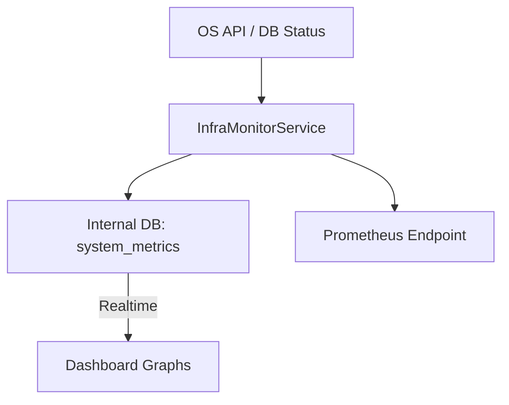

# Spec: System & Infrastructure Metrics

> **Story ID:** 3.5
> **Complexity:** STANDARD
> **Generated:** 2026-03-13T19:35:00Z
> **Status:** Draft

---

## 1. Overview

Esta especificação define a implementação do monitoramento de infraestrutura do sistema AIOX. O objetivo é coletar métricas de baixo nível (CPU, RAM, Disco, Rede e Banco de Dados) para garantir que o sistema opere dentro dos limites saudáveis de recursos e para fornecer dados para alertas proativos de escalabilidade ou falha de hardware.

### 1.1 Goals

- Coletar métricas de recursos do host (CPU, Memória, Disco, Rede) a cada 10s. (FR-1, FR-3)
- Monitorar a saúde e latência de consultas do banco de dados. (FR-2)
- Exibir gráficos de saúde da infraestrutura no dashboard. (FR-4)
- Configurar alertas de uso excessivo de recursos. (FR-5)
- Manter histórico de 7 dias para análise de tendências. (FR-3, AC-3.5.4)

### 1.2 Non-Goals

- Monitoramento de métricas de negócio (agentes) - tratado na Story 3.4.
- Orquestração de containers (Kubernetes/Docker health checks avançados).

---

## 2. Requirements Summary

### 2.1 Functional Requirements

| ID   | Description                                                                 | Priority | Source            |
| ---- | --------------------------------------------------------------------------- | -------- | ----------------- |
| FR-1 | Coleta de métricas do host (CPU, Memória, Disco, Rede).                     | P0       | requirements.json |
| FR-2 | Monitoramento de conexões e latência do DB.                                 | P0       | requirements.json |
| FR-3 | Persistência a cada 10s com histórico de 7 dias.                            | P0       | requirements.json |
| FR-4 | Visualização gráfica interativa no Dashboard.                               | P1       | requirements.json |
| FR-5 | Alertas para CPU > 80%, Memória > 85%, Disco > 90%.                         | P1       | requirements.json |

### 2.2 Non-Functional Requirements

| ID    | Category    | Requirement                                  | Metric               |
| ----- | ----------- | -------------------------------------------- | -------------------- |
| NFR-1 | Reliability | Independência de serviços externos.           | Fallback local       |
| NFR-2 | Performance | Impacto mínimo no sistema principal.         | < 2% CPU overhead    |

### 2.3 Constraints

| ID    | Type      | Constraint                                                    | Impact                                 |
| ----- | --------- | ------------------------------------------------------------- | -------------------------------------- |
| CON-1 | Technical | Uso de cliente Prometheus ou StatsD.                          | Padroniza exportação de métricas.      |

---

## 3. Technical Approach

### 3.1 Architecture Overview

Utilizaremos o `prom-client` para expor um endpoint `/metrics` compatível com Prometheus, mas também um serviço interno (`InfraMonitor`) que grava dados no PostgreSQL a cada 10s para alimentar o Dashboard em tempo real via Supabase.

### 3.2 Component Design

- **InfraMonitorService**: Serviço em background (cron/timer) que utiliza bibliotecas de OS para ler recursos.
- **MetricExporter**: Expõe métricas no formato Prometheus.
- **SystemDashboard**: Nova seção no Dashboard para visualização de infraestrutura.

### 3.3 Data Flow

---

## 4. Dependencies

### 4.1 External Dependencies

| Dependency | Version | Purpose | Verified |
| ---------- | ------- | ------- | -------- |
| os-utils   | latest  | Leitura de métricas de OS (CPU/Mem). | ✅       |
| prom-client| latest  | Exposição de métricas para Prometheus. | ✅       |

### 4.2 Internal Dependencies

| Module    | Purpose                                      |
| --------- | -------------------------------------------- |
| Supabase  | Persistência secundária para o Dashboard.     |

---

## 5. Files to Modify/Create

### 5.1 New Files

| File Path                               | Purpose                                      | Template |
| --------------------------------------- | -------------------------------------------- | -------- |
| `packages/api/src/services/infra.ts`    | Coletor central de métricas de infraestrutura.| -        |
| `packages/api/src/routes/metrics.ts`    | Endpoint de exportação Prometheus.            | -        |

### 5.2 Modified Files

| File Path                               | Changes                                      | Risk |
| --------------------------------------- | -------------------------------------------- | ---- |
| `packages/api/src/server.ts`            | Registro de rotas de métricas.                | Low  |
| `packages/dashboard/src/pages/Infra.tsx`| UI de monitoramento de recursos.              | low  |

---

## 6. Testing Strategy

### 6.1 Unit Tests

- Validação da extração de dados via `os-utils`.
- Verificação do formato Prometheus gerado.

### 6.2 Integration Tests

| Test                      | Components           | Scenario                                   |
| ------------------------- | -------------------- | ------------------------------------------ |
| Data Persistence Test     | InfraService -> DB   | Verificar se a cada 10s um novo record surge. |
| Dashboard Graph Load      | Frontend -> API      | Verificar se o gráfico renderiza dados das últimas 24h.|

---

## 7. Risks & Mitigations

| Risk                         | Probability | Impact | Mitigation                                      |
| ---------------------------- | ----------- | ------ | ----------------------------------------------- |
| Escrita excessiva no DB       | Med         | Med    | Política de retenção curta (7 dias) e batching. |
| Incompatibilidade de OS       | Low         | Low    | Usar bibliotecas cross-platform verificadas.    |

---

## 8. Open Questions

| ID   | Question                                            | Blocking | Assigned To |
| ---- | --------------------------------------------------- | -------- | ----------- |
| OQ-1 | Devemos instalar um servidor Prometheus local?      | No       | @devops     |

---

## 9. Implementation Checklist

- [ ] Instalar `os-utils` e `prom-client`
- [ ] Criar serviço `InfraMonitor`
- [ ] Implementar endpoint `/metrics`
- [ ] Criar tabela `system_metrics` com política de limpeza automática
- [ ] Desenvolver gráficos de CPU/Mem no Dashboard
- [ ] Configurar lógica de alerta de limiares de recursos

---

## Metadata

- **Generated by:** @aiox-master via spec-write-spec
- **Inputs:** requirements.json, complexity.json, research.json
- **Iteration:** 1
