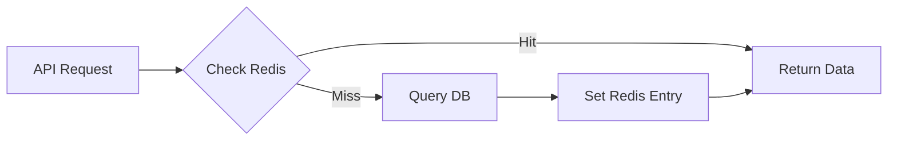

# Spec: Caching & Performance Optimization

> **Story ID:** 3.6
> **Complexity:** STANDARD
> **Generated:** 2026-03-13T20:05:00Z
> **Status:** Draft

---

## 1. Overview

Esta especificação define a estratégia de cache do AIOX Dashboard. O objetivo é reduzir a latência das consultas ao banco de dados e garantir que a interface permaneça rápida sob carga elevada, utilizando o Redis como camada de cache.

### 1.1 Goals

- Configurar e integrar o Redis no sistema. (FR-1, AC-3.6.1)
- Implementar cache para consultas frequentes (métricas, status, config). (FR-1, AC-3.6.2)
- Garantir propagação de updates em até 5s via lógica de invalidação. (FR-2, AC-3.6.3)
- Alcançar hit rate > 70% e latência p95 < 200ms. (NFR-1, NFR-2)
- Implementar fallback resiliente para falhas no Redis. (FR-3, AC-3.6.7)

### 1.2 Non-Goals

- Caching de arquivos estáticos (Asset Caching) - tratado pelo servidor web/CDN.
- Caching em nível de cliente (Browser Caching) agressivo - foco no cache do lado do servidor.

---

## 2. Requirements Summary

### 2.1 Functional Requirements

| ID   | Description                                                                 | Priority | Source            |
| ---- | --------------------------------------------------------------------------- | -------- | ----------------- |
| FR-1 | Implementar Redis para caching de consultas.                               | P0       | requirements.json |
| FR-2 | Invalidação de cache com propagação < 5s.                                   | P1       | requirements.json |
| FR-3 | Degradação graciosa em caso de indisponibilidade do Redis.                  | P1       | requirements.json |
| FR-4 | Estratégia de TTL configurável e documentada.                               | P2       | requirements.json |

### 2.2 Non-Functional Requirements

| ID    | Category    | Requirement                                  | Metric               |
| ----- | ----------- | -------------------------------------------- | -------------------- |
| NFR-1 | Performance | Latência p95 < 200ms com cache.              | p95 < 200ms          |
| NFR-2 | Performance | Hit rate > 70% sob carga típica.             | Hit Rate > 70%       |
| NFR-3 | Performance | Impacto de cache miss < 500ms.               | Miss Penalty < 500ms |

### 2.3 Constraints

| ID    | Type      | Constraint                                                    | Impact                                 |
| ----- | --------- | ------------------------------------------------------------- | -------------------------------------- |
| CON-1 | Technical | Uso mandatório do Redis.                                      | Define dependência de infraestrutura.  |

---

## 3. Technical Approach

### 3.1 Architecture Overview

Utilizaremos o padrão **Cache-aside**. A aplicação primeiro busca no Redis; se não encontrar (cache miss), busca no banco de dados e popula o Redis.

### 3.2 Component Design

- **CacheService**: Classe wrapper para o `ioredis` com métodos `get`, `set` e `invalidate`.
- **Interceptors/Middlewares**: Para aplicar cache automaticamente em rotas GET da API.
- **TTL Manager**: Define as durações por tipo de dado.

### 3.3 Data Flow



---

## 4. Dependencies

### 4.1 External Dependencies

| Dependency | Version | Purpose | Verified |
| ---------- | ------- | ------- | -------- |
| ioredis    | ^5.0.0  | Cliente Redis performante. | ✅       |

### 4.2 Internal Dependencies

| Module    | Purpose                                      |
| --------- | -------------------------------------------- |
| DB Layer  | Fallback em caso de miss ou falha no Redis.  |

---

## 5. Files to Modify/Create

### 5.1 New Files

| File Path                               | Purpose                                      | Template |
| --------------------------------------- | -------------------------------------------- | -------- |
| `packages/api/src/services/cache.ts`    | Wrapper para operações de Redis.              | -        |
| `packages/api/src/middleware/cache.ts`  | Middleware para cache automático de rotas.   | -        |

### 5.2 Modified Files

| File Path                               | Changes                                      | Risk |
| --------------------------------------- | -------------------------------------------- | ---- |
| `packages/api/src/app.ts`               | Inicialização da conexão Redis.              | Med  |
| `packages/api/src/controllers/*.ts`     | Adição de decorators/middleware de cache.    | Med  |

---

## 6. Testing Strategy

### 6.1 Unit Tests

- Mock do Redis para testar lógica de GET/SET.
- Verificação do TTL correto sendo passado.

### 6.2 Integration Tests

| Test                      | Components           | Scenario                                   |
| ------------------------- | -------------------- | ------------------------------------------ |
| Redis Failover Test       | API -> Redis         | Matar processo Redis e verificar se API continua funcionando via DB.|
| Multiple Hits Test        | API -> Redis         | Hit inicial (miss) seguido de múltiplos hits.|

### 6.3 Acceptance Tests (Given-When-Then)

```gherkin
Feature: Dashboard Caching

  Scenario: Retrieval from cache
    Given que um dado já foi consultado e está em cache
    When o usuário solicita o mesmo dado novamente
    Then a resposta deve vir do Redis em < 50ms
    And o contador de Hit Rate deve subir

  Scenario: Cache invalidation
    Given que um dado está em cache
    When o dado é atualizado no banco de dados principal
    Then o registro correspondente no Redis deve ser invalidado ou atualizado em < 5s
```

---

## 7. Risks & Mitigations

| Risk                         | Probability | Impact | Mitigation                                      |
| ---------------------------- | ----------- | ------ | ----------------------------------------------- |
| Dados obsoletos (Stale Data)  | Med         | Low    | Configurar TTLs curtos e invalidar em updates.  |
| Cache Stampede               | Low         | High   | Implementar locks otimistas para repopulação.   |
| Redis como SPOF              | Low         | High   | Garantir bypass transparente em falhas.         |

---

## 8. Open Questions

| ID   | Question                                            | Blocking | Assigned To |
| ---- | --------------------------------------------------- | -------- | ----------- |
| OQ-1 | Qual o tamanho máximo de RAM do Redis permitido?    | No       | @devops     |

---

## 9. Implementation Checklist

- [ ] Subir instância experimental Redis
- [ ] Implementar `CacheService` com Ioredis
- [ ] Implementar Middleware de Cache para rotas da API
- [ ] Configurar TTLs por categoria de dados
- [ ] Desenvolver lógica de invalidação para métricas em tempo real
- [ ] Realizar teste de carga para validar Hit Rate > 70%

---

## Metadata

- **Generated by:** @aiox-master via spec-write-spec
- **Inputs:** requirements.json, complexity.json, research.json
- **Iteration:** 1
