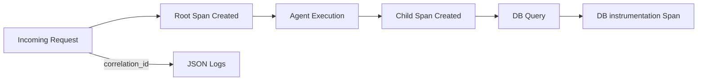

# Spec: Distributed Tracing & Logging

> **Story ID:** 3.7
> **Complexity:** STANDARD
> **Generated:** 2026-03-13T21:05:00Z
> **Status:** Draft

---

## 1. Overview

Esta especificação define a implementação de rastreamento distribuído (Distributed Tracing) e logs estruturados para o ecossistema AIOX. O objetivo é permitir que engenheiros acompanhem o fluxo de uma requisição desde a API até a execução de agentes e consultas ao banco de dados, facilitando a depuração em sistemas distribuídos.

### 1.1 Goals

- Integrar OpenTelemetry SDK no backend. (FR-1, AC-3.7.1)
- Propagar IDs de Correlação entre serviços e processos. (FR-2, AC-3.7.3)
- Implementar logs estruturados em formato JSON. (FR-3, AC-3.7.4)
- Capturar traces completos: API -> Agent -> DB. (FR-2, AC-3.7.5)
- Manter o overhead de performance abaixo de 10%. (NFR-1, AC-3.7.8)

### 1.2 Non-Goals

- Implementar um tracer customizado do zero (usaremos OpenTelemetry).
- Gerenciar a infraestrutura do coletor de traces (Jaeger/DataDog) - assumido como pré-existente ou tratado via OTel Collector local.

---

## 2. Requirements Summary

### 2.1 Functional Requirements

| ID   | Description                                                                 | Priority | Source            |
| ---- | --------------------------------------------------------------------------- | -------- | ----------------- |
| FR-1 | Integração com SDK do OpenTelemetry.                                        | P0       | requirements.json |
| FR-2 | Propagação de Correlation IDs e Contexto.                                   | P1       | requirements.json |
| FR-3 | Logs estruturados (JSON) com contexto de trace.                             | P1       | requirements.json |
| FR-4 | Visualização básica de traces no Dashboard (links ou widgets).              | P2       | requirements.json |

### 2.2 Non-Functional Requirements

| ID    | Category    | Requirement                                  | Metric               |
| ----- | ----------- | -------------------------------------------- | -------------------- |
| NFR-1 | Performance | Overhead de tracing deve ser < 10%.           | Overhead < 10%       |
| NFR-2 | Observability| Suporte a amostragem (sampling) configurável. | Sampling Config      |

### 2.3 Constraints

| ID    | Type      | Constraint                                                    | Impact                                 |
| ----- | --------- | ------------------------------------------------------------- | -------------------------------------- |
| CON-1 | Technical | Uso de padrões OpenTelemetry.                                 | Garante interoperabilidade.            |

---

## 3. Technical Approach

### 3.1 Architecture Overview

Utilizaremos o **OpenTelemetry SDK para Node.js**.
1. **Instrumentation**: Auto-instrumentação para bibliotecas comuns (HTTP, Postgres).
2. **Context Propagation**: Uso do `W3C Trace Context` para passar o traceId entre camadas.
3. **Structured Logging**: Substituição do `console.log` por um Logger estruturado (Pino ou Winston) que injeta o `trace_id` e `span_id` automaticamente nos logs.

### 3.2 Component Design

- **TracingManager**: Inicializa o SDK no início da aplicação.
- **AgentTraceWrapper**: Cria spans detalhados para cada invocação de agente.
- **LogProcessor**: Formata e correlaciona logs com spans ativos.

### 3.3 Data Flow



---

## 4. Dependencies

### 4.1 External Dependencies

| Dependency | Version | Purpose | Verified |
| ---------- | ------- | ------- | -------- |
| @opentelemetry/api | latest | Interface de tracing. | ✅       |
| @opentelemetry/sdk-node | latest | Implementação do SDK. | ✅       |
| pino | latest | Logger estruturado de alta performance. | ✅       |

---

## 5. Files to Modify/Create

### 5.1 New Files

| File Path                               | Purpose                                      | Template |
| --------------------------------------- | -------------------------------------------- | -------- |
| `packages/api/src/tracing.ts`           | Configuração e inicialização do OTel.         | -        |
| `packages/api/src/utils/logger.ts`      | Fábrica de logs estruturados.                | -        |

### 5.2 Modified Files

| File Path                               | Changes                                      | Risk |
| --------------------------------------- | -------------------------------------------- | ---- |
| `packages/api/src/index.ts`             | Importar `tracing.ts` antes de qualquer módulo. | High |
| `packages/core/src/agents/base-agent.ts`| Adicionar spans manuais para lógica de agente.| Med  |

---

## 6. Testing Strategy

### 6.1 Unit Tests

- Verificar se o Logger injeta IDs de trace corretamente quando um contexto está ativo.
- Validar a propagação de cabeçalhos de contexto W3C.

### 6.2 Integration Tests

| Test                      | Components           | Scenario                                   |
| ------------------------- | -------------------- | ------------------------------------------ |
| Trace Correlation Test    | API -> Agent -> DB    | Validar se todos os spans pertencem ao mesmo `trace_id`.|
| Sampling Test             | OTel SDK             | Verificar se apenas o percentual configurado de traces é exportado.|

### 6.3 Acceptance Tests (Given-When-Then)

```gherkin
Feature: Distributed Tracing

  Scenario: Request tracing
    Given que um request de API é recebido
    When o sistema processar a tarefa via agente
    Then um trace único deve ser gerado
    And os logs gerados durante essa execução devem conter o mesmo trace_id

  Scenario: Performance Overhead
    Given que o sistema está sob carga
    When o tracing estiver habilitado com amostragem de 10%
    Then o overhead de CPU/Latência deve ser < 10% comparado ao sistema sem tracing
```

---

## 7. Risks & Mitigations

| Risk                         | Probability | Impact | Mitigation                                      |
| ---------------------------- | ----------- | ------ | ----------------------------------------------- |
| Impacto excessivo na performance | High        | Med    | Utilizar amostragem (sampling) agressiva (ex: 1%).|
| Explosão no volume de logs    | Med         | Med    | Usar níveis de log corretos e remover logs verbosos em prod.|
| Quebra de contexto em async   | Med         | Low    | Usar `AsyncLocalStorage` via OTel Context.      |

---

## 8. Open Questions

| ID   | Question                                            | Blocking | Assigned To |
| ---- | --------------------------------------------------- | -------- | ----------- |
| OQ-1 | Qual coletor (backend) de traces usaremos?          | No       | @architect  |

---

## 9. Implementation Checklist

- [ ] Implementar `tracing.ts` com OTel
- [ ] Implementar Logger estruturado com Pino
- [ ] Atualizar entrypoint da API para carregar tracing prematuramente
- [ ] Adicionar instrumentação manual na classe BaseAgent
- [ ] Validar fluxo de traces no coletor (Jaeger local)
- [ ] Configurar amostragem baseada em ambiente (Prod vs Dev)

---

## Metadata

- **Generated by:** @aiox-master via spec-write-spec
- **Inputs:** requirements.json, complexity.json, research.json
- **Iteration:** 1
