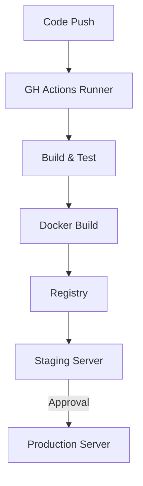

# Spec: CI/CD Integration & Deployment

> **Story ID:** 3.8
> **Complexity:** STANDARD
> **Generated:** 2026-03-13T20:35:00Z
> **Status:** Draft

---

## 1. Overview

Esta especificação define o pipeline de entrega contínua para o AIOX Dashboard. O objetivo é automatizar o processo de build, teste e deploy, garantindo que novas funcionalidades sejam entregues de forma segura e determinística nos ambientes de homologação (Staging) e produção.

### 1.1 Goals

- Implementar workflows do GitHub Actions para o Dashboard. (FR-1, AC-3.8.1)
- Garantir builds rápidos (< 30s) e testes automatizados em cada PR. (AC-3.8.2)
- Padronizar a entrega via Docker. (FR-2, AC-3.8.3)
- Habilitar deploy automático para Staging e manual para Produção. (FR-3, AC-3.8.4, AC-3.8.5)
- Estabelecer capacidade de Rollback rápido. (FR-4, AC-3.8.6)

### 1.2 Non-Goals

- Automação de provisionamento de infraestrutura (Terraform/CloudFormation) fora do escopo imediato de deploy.
- Monitoramento de uptime externo - tratado por ferramentas de status check.

---

## 2. Requirements Summary

### 2.1 Functional Requirements

| ID   | Description                                                                 | Priority | Source            |
| ---- | --------------------------------------------------------------------------- | -------- | ----------------- |
| FR-1 | Workflow do GH Actions para builds e testes.                                | P0       | requirements.json |
| FR-2 | Criação e publicação de imagens Docker.                                     | P1       | requirements.json |
| FR-3 | Deploy automático (Staging) e manual (Prod).                                | P0       | requirements.json |
| FR-4 | Estratégia de Rollback testada.                                             | P1       | requirements.json |

### 2.2 Non-Functional Requirements

| ID    | Category    | Requirement                                  | Metric               |
| ----- | ----------- | -------------------------------------------- | -------------------- |
| NFR-1 | Performance | Tempo de build do dashboard < 30s.           | build < 30s          |
| NFR-2 | Traceability| Log completo de todos os deploys.            | 100% de logs         |

### 2.3 Constraints

| ID    | Type      | Constraint                                                    | Impact                                 |
| ----- | --------- | ------------------------------------------------------------- | -------------------------------------- |
| CON-1 | Technical | Uso mandatório do GitHub Actions.                             | Define a plataforma de CI/CD.          |

---

## 3. Technical Approach

### 3.1 Architecture Overview

Utilizaremos o GitHub Actions como orquestrador. O fluxo será disparado por eventos de Pull Request e Merge. As imagens serão construídas usando Docker multi-stage para eficiência.

### 3.2 Pipeline Steps

1. **Lint & Typecheck**: Verificação estática de código.
2. **Build**: Geração do bundle de produção do Dashboard.
3. **Dockerize**: Empacotamento em imagem Alpine Linux.
4. **Push**: Upload para o Registry (ex: GitHub Packages ou Docker Hub).
5. **Deploy**: Atualização do ambiente remoto via SSH ou Webhook.

### 3.3 Data Flow



---

## 4. Dependencies

### 4.1 External Dependencies

| Dependency | Version | Purpose | Verified |
| ---------- | ------- | ------- | -------- |
| GitHub Actions | latest | Orquestração de pipeline. | ✅       |
| Docker     | latest  | Containerização. | ✅       |

---

## 5. Files to Modify/Create

### 5.1 New Files

| File Path                               | Purpose                                      | Template |
| --------------------------------------- | -------------------------------------------- | -------- |
| `.github/workflows/dashboard-ci.yml`    | Workflow principal de integração contínua.   | -        |
| `packages/dashboard/Dockerfile`         | Definição da imagem de produção.              | -        |

### 5.2 Modified Files

| File Path                               | Changes                                      | Risk |
| --------------------------------------- | -------------------------------------------- | ---- |
| `packages/dashboard/package.json`       | Ajuste de scripts de build para produção.    | Low  |

---

## 6. Testing Strategy

### 6.1 Pipeline Tests

- Verificação se o workflow falha corretamente caso os testes não passem.
- Verificação se segredos (secrets) não são expostos nos logs.

### 6.2 Deployment Tests

| Test                      | Components           | Scenario                                   |
| ------------------------- | -------------------- | ------------------------------------------ |
| Smoke Test (Post-Deploy)  | Dashboard UI         | Verificar status 200 após deploy em Staging.|
| Rollback Test             | Infrastructure       | Forçar falha no deploy e reverter versão.   |

### 6.3 Acceptance Tests (Given-When-Then)

```gherkin
Feature: Automated CI/CD

  Scenario: Build on Pull Request
    Given que um desenvolvedor abriu um PR no repositório
    When o workflow do GitHub Actions for disparado
    Then o código deve ser compilado e testado em < 3m
    And o status do build deve ser reportado no PR

  Scenario: Production Promotion
    Given que a versão em Staging foi validada
    When um administrador clica em "Approve" no workflow
    Then a imagem Docker correspondente deve ser enviada para Produção
```

---

## 7. Risks & Mitigations

| Risk                         | Probability | Impact | Mitigation                                      |
| ---------------------------- | ----------- | ------ | ----------------------------------------------- |
| Falha no Registry             | Low         | High   | Utilizar caching de imagens no runner.          |
| Downtime em Deploy            | Med         | Med    | Implementar Blue-Green ou deploy atômico (symlink).|
| Segredos Expostos             | Low         | High   | Usar GitHub Secrets e mascaramento.             |

---

## 8. Open Questions

| ID   | Question                                            | Blocking | Assigned To |
| ---- | --------------------------------------------------- | -------- | ----------- |
| OQ-1 | Onde será hospedado o Registry oficial de imagens?   | No       | @devops     |

---

## 9. Implementation Checklist

- [ ] Criar `Dockerfile` multi-stage para o Dashboard
- [ ] Implementar `.github/workflows/dashboard-ci.yml`
- [ ] Configurar GitHub Secrets (Registry, Server SSH)
- [ ] Validar tempo de build < 30s em runners padrão
- [ ] Testar fluxo de rollback manual
- [ ] Documentar procedimento de promoção para Produção

---

## Metadata

- **Generated by:** @aiox-master via spec-write-spec
- **Inputs:** requirements.json, complexity.json, research.json
- **Iteration:** 1
